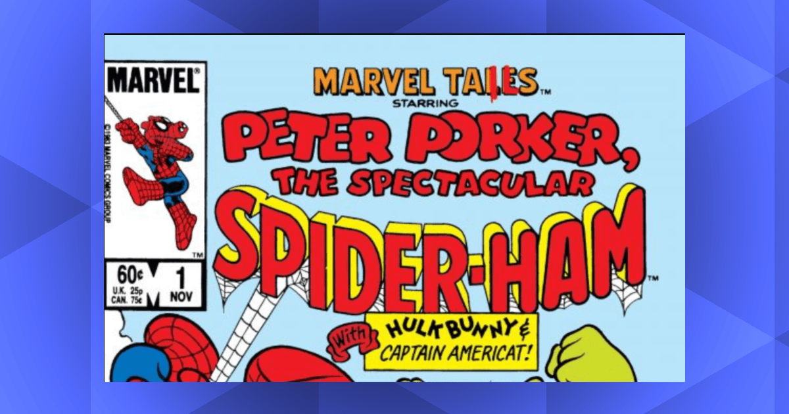
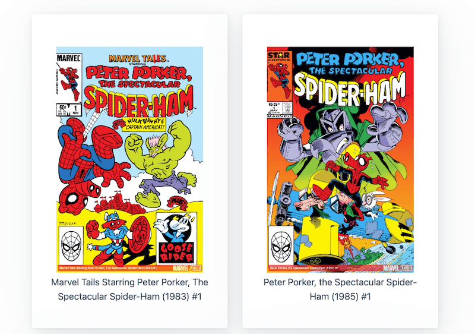

[](https://app.netlify.com/sites/spider-ham/deploys)
# Learning Lab


## Eleventy with cached API content using eleventy-fetch

> Date Published: February 25, 2023

This lab demonstrates how to utilize the @eleventy/eleventy-fetch plugin to retrieve data from an API, cache it for a week, and use it in an Eleventy generated site.

It will call the Marvel API, retrieve the most recent 75 comic book covers for a specific character, and display them on an HTML page.

You can see the example here: [Peter Porker, the amazing Spider-Ham](https://spider-ham.box464.com).

This lab will not go into detail about how to setup an eleventy site, but here's [a good starter](https://www.11ty.dev/docs/getting-started/). (not required to complete this lab).

Want a more detailed walk through of the process? My blog post [walks you through all the inner workings](https://box464.com/posts/eleventy-fetch-marvel/) and provides insights into how eleventy-fetch magic makes all this happen.

# Marvel Developer Portal
You'll need a Marvel Developer account. Create a new login or login to your existing [Marvel account](https://www.marvel.com/signin?referer=https%3A%2F%2Fdeveloper.marvel.com%2Faccount). If you are creating a new account, **be sure to un-tick all the email opt-ins**.

Once your account is created, you can go to your [developer account page](https://developer.marvel.com/account) and see your public and private keys. 

You'll need both of these for the lab. 

# Clone the repository
Grab a copy of this repo to work on locally.

`https://github.com/jeffsikes/box464-lab-eleventy-spiderpig.git`

## Creating .env variables
An .env file is utilized to keep data out of your inline code. These variables can then be transferred into key/value pairs in your deployments to Netlify, if you're going that route, so they are never part of the code that gets stored or shown in your repository.

**Be sure to .env is in your .gitignore file, this project includes it by default.**

Create an .env file at the root of this project, and add the following lines:

**.env**
```
MARVEL_CHARACTERS_NAME_STARTS_WITH=Spider
MARVEL_CHARACTER_ID=[MARVEL_CHARACTER_ID] 
MARVEL_PUBLIC_API_KEY=[YOUR_MARVEL_PUBLIC_API_KEY]
MARVEL_PRIVATE_API_KEY=[YOUR_MARVEL_PRIVATE_API_KEY]
```

These values will be used to call the API and return the most recent 50 comic book covers for that character.

My favorite character is Spider-Ham, so for him, use a MARVEL_CHARACTER_ID of 1011347.

Not a Spider-Ham fan? Find [your own favorite Spider in the Spiderverse](https://spider-ham.box464.com/characters), and copy the Marvel Character Id. 

Change the .env variable for "MARVEL_CHARACTER_ID" to your preferred character id.

# Install Packages
There are a few packages to install first from the terminal.

```
npm install
```

Then build it to get the cached data.
```
npm run build
```

Once that completes, you're ready to go!

```
npm start
```

This should start up a local server in your environment, as well as pull the comic book cover data from the API.

> If you have previously run this request with the Spider-Ham character, and you changed to a different one, you'll need to remove the cached data from the .cache file (just delete all the files in the folder). Then run the build again.

Congratulations! You comic book covers should be displaying.



Go have fun - change some code, break things, make it your own. :smile:

# How does it work?
@eleventy/eleventy-fetch is a wrapper around a simple javascript fetch request, but it has some interesting features. The content it returns is stored in the .cache folder by default, and the content can be configured to be cached for specific periods of time - it won't make the API call each time you do a build, only after the expiration date on the cache has passed. Neat! 

Here's the call and the configuration I've set by default for this lab.

This little bit of magic can be found in /src/_data/marvelCovers.js

```
let json = await EleventyFetch(url, {
      duration: "1w", // only fetch new data after 1 week 
      type: "json", // also supports "text" or "buffer"
      removeUrlQueryParams: true 
    });
```
# Build Dependencies
The following technologies are utilized for this build. All are open source or free tier. The others will be installed during the build.

* [Marvel Developer API](https://developer.marvel.com/) (requires account, but free)
* [Eleventy](https://www.11ty.dev/)
* [Eleventy Plugin: @eleventy/eleventy-fetch](https://www.11ty.dev/docs/plugins/fetch/)
* [Nunjuks Templating Language](https://mozilla.github.io/nunjucks/templating.html)
* [Markdown Language](https://www.markdownguide.org/)
* [Pico CSS](https://picocss.com/)
* [Dotenv](https://github.com/motdotla/dotenv)
* [MD5 hashing](https://github.com/motdotla/dotenv)

# Reference Material
* https://www.11ty.dev/docs/plugins/fetch/
* https://picocss.com/docs/
* https://developer.marvel.com/documentation/authorization
* https://github.com/motdotla/dotenv
* https://github.com/pvorb/node-md5
* https://github.com/jakejarvis/netlify-plugin-cache

